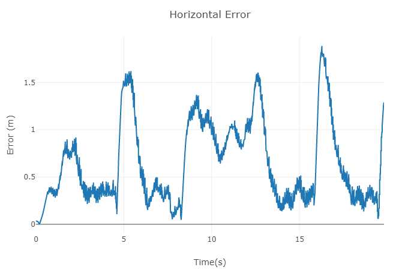
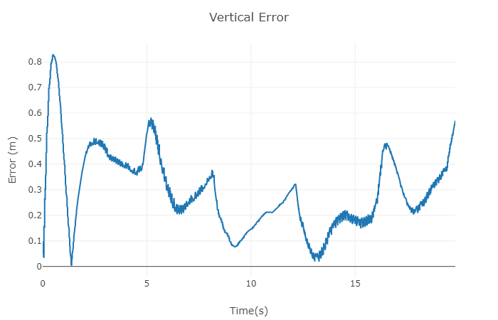

# Project: Building a Controller

## Writeup

### 1. Provide a Writeup / README that includes all the rubric points and how you addressed each one. You can submit your writeup as markdown or pdf.

You are reading it! Below I'll describe how I addressed each rubric point and where my code each point is handled.

## Implemented Controller

### 1. Implemented body rate control in python and C++.

For the python part, please refer to function `body_rate_control` in L168 -- L182 in `controller.py` for the code. For the C++ part, please refer to function `QuadControl::BodyRateControl` in L102 -- L128 in `QuadControl.cpp`. Math behind the scene is:

$$
\begin{aligned}
\dot\omega &= K_p * (\omega_c - \omega) \\
\tau &= I * \dot\omega
\end{aligned}
$$

Where $\dot\omega$ is the angular acceleration round x-axis, y-axis and z-axis in body frame. $\omega_c$ is the commanded angular velocity in body frame, while $\omega$ is the actual angular velocity in body frame. $K_p$ is the control gain parameter. $I$ is the moment of inertia, and finally $\tau$ is the resulting moment. All variables are vectors unless explicitly stated otherwise.

### 2. Implement roll pitch control in python and C++.

For the python part, please refer to function `roll_pitch_controller` in L139 -- L166 in `controller.py`. For the C++ part, please refer to function `QuadControl::RollPitchControl` in L131 -- L178 in `QuadControl.cpp`. Math behind the scene is:

$$
\begin{aligned}
c_c &= F_{thrust} / m\\
b_c &= a_c / c_c \\
\dot b &= K_p * (b_c - b) \\
\begin{bmatrix}
p_c\\
q_c\\
\end{bmatrix}
&=
\frac{1}{R_{33}}
\begin{bmatrix}
\dot b_c^x\\
\dot b_c^y\\
\end{bmatrix}
\begin{bmatrix}
R_{21} & -R_{11}\\
R_{22} & -R_{12}
\end{bmatrix}

\end{aligned}
$$

Where $F_{thrust}$ is the total thrust and $m$ is the mass of the drone (scalar). $a_c$ is the commanded acceleration. $K_p$ is the control gain parameter. $R$ is the rotation matrix w.r.t. the current attitude of the drone, and $b$ is the last column vector of $R$ (that is, $b_x$ = $R_{13}$, $b_y$ = $R_{23}$, $b_z$ = $R_{33}$). $p_c$ and $q_c$ are the commanded body rate around x-axis and y-axis (scalars), which will be fed to body rate control.

### 3. Implement altitude control in python.

Please refer to function `altitude_control` in L109 -- L137 in `controller.py`. Math behind the scene is:

$$
\begin{aligned}
\ddot z_c &= K_p * (z_c - z) + K_d * (\dot z_c - \dot z) + K_i * \int(z_c - c)dt +  \ddot z_{ff} \\
F_{thrust} &= \ddot z_c * m / b_z
\end{aligned}
$$

Where $\ddot z_c$ is the commanded acceleration along the z-axis in inertial frame, $z_c$, $z$, $\dot z_c$ and $\dot z$ is the commanded/actual altitude and commanded/actual velocity along the z axis in inertial frame. $\ddot z_{ff}$ is the feed-forward acceleration and $K_p$, $K_d$, $K_i$ are the control gain parameters. All variables in above equations are scalars.

In python part, PD control is used (without the integral term). The output $F_{thrust}$ is clipped before return to meet quad dynamics.

### 4. Implement altitude controller in C++.

Please refer to function `QuadControl::AltitudeControl` in L180 -- L217 in `QuadControl.cpp`. Math is similar with the python part.

### 5. Implement lateral position control in python and C++.

For the python part, please refer to function `lateral_position_control` in L91 -- L107 in `controller.py`. For the C++ part, please refer to function `QuadControl::LateralPositionControl` in L220 -- L258 in `QuadControl.cpp`. Math behind the scene is:

$$
\begin{aligned}
\ddot {p}_c &= K_p * (p_c - p) + K_d * (\dot p_c - \dot p) +  \ddot p_{ff}
\end{aligned}
$$

Quite similar with altitude control, $\ddot x_c$ is the commanded acceleration along the x-axis and y-axis in inertial frame, $p_c$, $p$, $\dot p_c$ and $\dot p$ is the commanded/actual horizonal position and commanded/actual horitonzal velocity in inertial frame. $\ddot p_{ff}$ is the feed-forward acceleration and $K_p$, $K_d$ are the control gain parameters.

Necessary clipping is performed to meet the quad dynamics.

### 6. Implement yaw control in python and C++.

For the python part, please refer to function `yaw_control` in L184 -- L202 in `controller.py`. For the C++ part, please refer to function `QuadControl::YawControl` in L261 -- L282 in `QuadControl.cpp`. Math behind the scene is:

$$
\begin{aligned}
\omega_r = K_p * ((\psi_c - \psi )\;\mathrm{fmod}\; \pi)
\end{aligned}
$$

Where $\omega_r$ is the angular velocity around the z-axis in body frame. It is the same as angular velocity of yaw angle ($\dot\psi$) in inertial frame. $\psi_c$ and $\psi$ is the commanded yaw angle and actual yaw angle of the drone. $K_p$ is the control gain parameter. $\mathrm{fmod}\;\pi$ is an equivalent operation as $\mathrm{mod}\;N$ in integer arithmetic. If $a = q * \pi + r, |r| < \pi$, then $a\;\mathrm{fmod}\; \pi = r$. All variables above are scalars.

$\omega_r = \dot\psi$ holds because with Euler angles in Yaw-Pitch-Roll order, rotation about yaw is applied last. It is not affected by roll and/or pitch rotation so can be considered separately.

### 7. Implement calculating the motor commands given commanded thrust and moments in C++.

Please refer to function `QuadControl::GenerateMotorCommands` in L56 -- L100 in `QuadControl.cpp`. Math behind the scene is:

We have equations array representing the fact that:

$$
\begin{aligned}
F_1 + F_2 + F_3 + F_4 & =  F_{thrust} \\
(F_1 - F_2 - F_3 + F_4) * L & = \tau_x \\
(F_1 + F_2 - F_3 - F_4) * L & = \tau_y \\
\tau_1 - \tau_2 + \tau_3 - \tau_4 = -\kappa * (F_1 - F_2 + F_3 - F_4) &= \tau_z \\
\end{aligned}
$$

Where $F_{1\dots 4}$ is the thrust generated by motor 1 to 4 and $\tau_{1\dots 4}$ is the reactive moment. $\kappa$ is the drag-thrust ratio. $\tau_x$, $\tau_y$ and $\tau_z$ is the collective moment around x/y/z axis in body frame. All variables above are scalars. 

Also notice motors are labeled in the order of front-left, front-right, rear-right, rear-left as 1 to 4.

Solve it and we'll get:

$$
\begin{aligned}
F_1 &= (a + b + c + d) / 4 \\
F_2 &= (a - b + c - d) / 4 \\
F_3 &= (a - b - c + d) / 4 \\
F_4 &= (a + b - c - d) / 4
\end{aligned}
$$

where 

$$
\begin{aligned}
a &= F_{thrust} \\
b &= \tau_x / L \\
c &= \tau_y / L \\
d &= -\kappa\tau_z
\end{aligned}
$$

## Flight Evaluation

The test trajectory in the python part contains several sharp turning and the reference (target) velocity is not smooth. Overshoot is very obvious and hard to avoid when handling with turns. Depending on the performance of the simulator, the resulting error may exceed the required limit. I manage to meet the evaluation metrics most time with my computer, but it will still fail sometimes. Below are charts of horizontal/vertical errors for one flight in python part.

For the C++ part, the controller shall be able to fly the drone passing all the scenarios.
